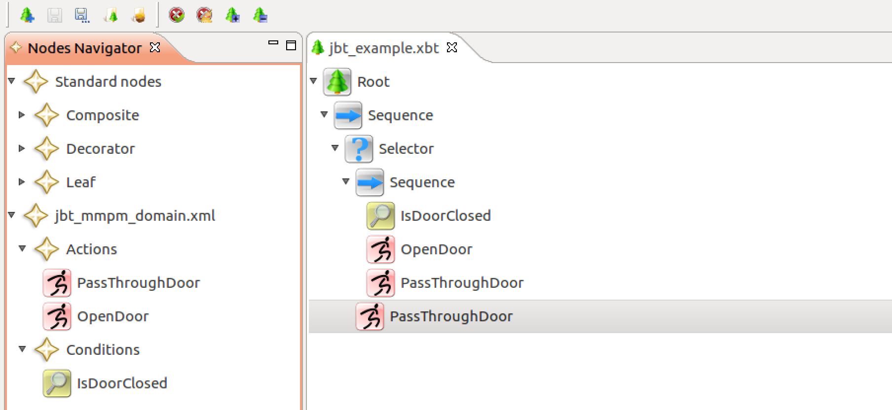
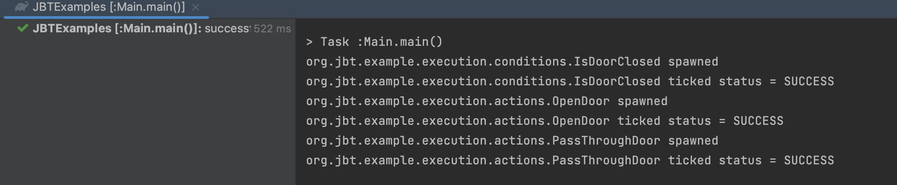

# JBTExamples
Java Behaviour Trees Examples Using gaia-ucm/jbt
# Github 地址
https://github.com/gaia-ucm/jbt

# 简单介绍
Behaivor Tree 在游戏和机器人开发领域是常见的一开发技巧。通常来说C++语言的开源库 https://www.behaviortree.dev/docs/intro 是目前维护的最好，并且使用最多的。
但是对于其他语种的开发者来说，比如Java开发者，jbt (https://github.com/gaia-ucm/jbt) 不失为一种选择，jbt 实现了Behavior Tree核心逻辑，
并且有JBTEditor 这款UI工具实现图形化编辑Behavior Tree，基本能够满足项目要求。

但是官方以及网上关于可以直接运行的Demo比较少，所以我这里尝试做一个简单的示例。方便大家学习交流。

# 学习步骤
## 阅读官方的文档
https://sourceforge.net/projects/jbt/files/UserGuide/UserGuide_0.0.2/
熟悉常见的Behavior Tree概念
- 控制节点： Sequence , Selector, Paraller 等
- 装饰节点：Inverter ， Repeat， Succeeder 等
- 叶子节点： Subtree Lookup ， Success ， Failure 等

## 使用JBTEditor
https://sourceforge.net/projects/jbt/files/JBTEditor/JBTEditor_0.0.2/
这里申明一下我在Java 8环境下使用https://sourceforge.net/projects/jbt/files/JBTEditor/JBTEditor_0.0.2/Linux_x86_64/ 运行没问题，如果你运行有问题，可以尝试和我的一致。

## 如何定义Action 和 Condition
在JBT里面使用了Make Me Play Me (MMPM) domain files进行定义。

## 使用JBTCore
将bt 和 mmpm文件转换成Java 文件 , 这里可以参考项目下JBTCore 文件夹下新增了一个GeneratorSupport.java 文件，并且使用VSCode 打开可以直接运行。

## 补充Action 和Condition的逻辑
参考Demo程序
## 构建应用运行
参考Demo程序

## JBTEditor 截图

## 门关闭先开门再从门过去

## 开门则直接从门过去
